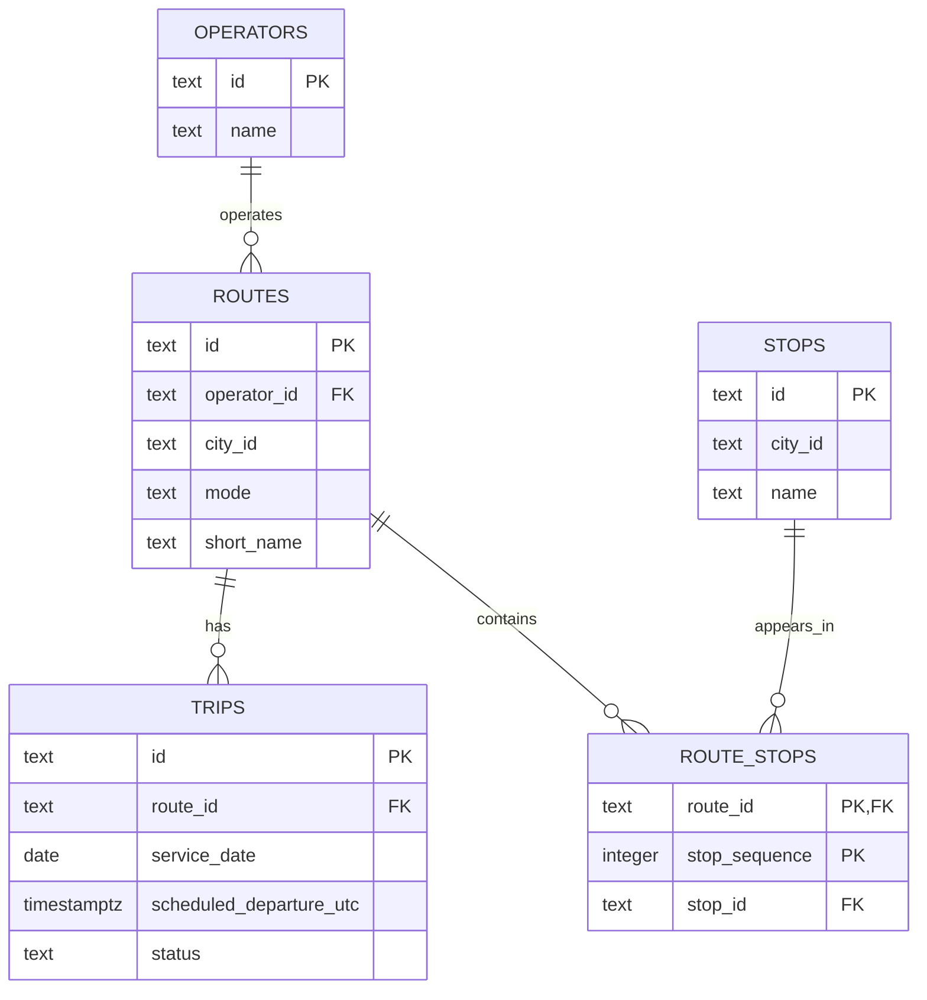

# Lecture 1 notes

## Workload map

Journey search mainly reads routes, stops, trips, prices and availability. It needs low latency, and slightly stale data can be acceptable while a customer is browsing.

Ticket purchase reads and writes trips, products, tickets, payments and availability. Correctness matters more here because a purchase must not be created from inconsistent data.

Ticket validation needs fast reads and writes against tickets and validation records. The result must be trustworthy at boarding time.

Timetable maintenance changes routes, stops and trips. Those changes need to become visible to journey search.

Real time availability is read frequently and written less often. Approximate data can be acceptable for search, but a purchase needs a reliable availability decision.

Reporting reads larger historical sets and performs aggregation. It can tolerate more latency than the operational workloads.

## Relational model

The model is intentionally small. It covers operators, routes, ordered route stops and scheduled trips. Ticketing, payments, validation, real time capacity and reporting are outside this first slice.

## Modelling choice

A stop is allowed to appear more than once on the same route. Because of that, `route_stops` uses `(route_id, stop_sequence)` as its primary key instead of `(route_id, stop_id)`. Each position is unique, but the same stop can still occur at different positions.

The functional dependency used here is:

`route_id, stop_sequence -> stop_id`

For one route, a sequence position identifies one stop. Keeping route data, stop data and route ordering in separate relations also avoids repeating stop names in route rows.

## Query evidence

The three queries cover the released workloads: upcoming trips for a route, ordered stops for a route, and trip counts per route for a service date. The third query uses a left join so routes with no matching trips are still returned with a count of zero.

The seed contains two trips for M2 and two for 5C on 31 August 2026. M2 has Nørreport, Kongens Nytorv and Copenhagen Airport in sequence. Running the trip count query for a date with no seeded trips still returns both routes with zero trips.
